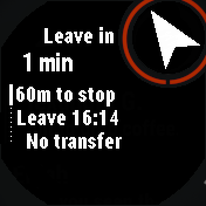
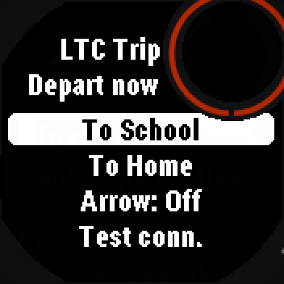
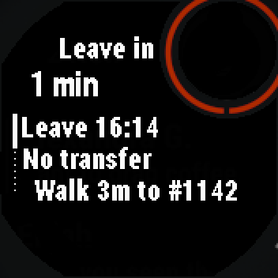
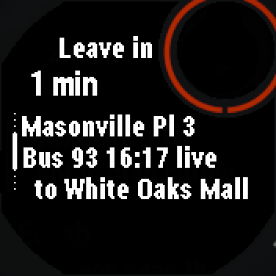
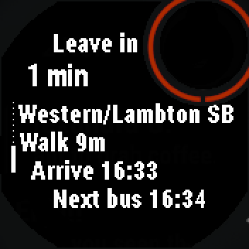

# LTC Trip

A personal, text-only Garmin Connect IQ watch app that tells you when to leave
for the London Transit Commission (LTC) bus in London, Ontario, plus the small
Cloudflare Worker it talks to.

- `watch/`: Connect IQ device app for the Instinct 3 Solar 45mm (`instinct3solar45mm`).
- `worker/`: Cloudflare Worker. It asks [Transitous](https://transitous.org/) for a
  trip, trims the answer to about 200–500 bytes of display-ready text and adds
  LTC stop-closure alerts.

```
watch --makeWebRequest (HTTPS, via Garmin Connect on the phone)--> Worker
Worker --> https://api.transitous.org/api/v5/plan      (trip plan)
Worker --> http://gtfs.ltconline.ca/Alert/Alerts.json  (stop closures, cached 60 s)
```

## Screenshots

Simulator shots (Instinct 3 Solar 45mm, live Worker, from public places).



The top-right circle points to your stop and the top line shows how far it is.



Pick To School, To Home or one of your own places. Arrow On/Off is right on the menu.





When to leave, which bus, transfers and arrival time, scrolling on the watch with no map.


Already at your destination? It tells you instead of planning a trip.

## Data and attribution

- Trip plans come from **Transitous**, a free, volunteer-run public transport
  routing service. Data sources and their licences (including OpenStreetMap):
  https://transitous.org/sources/ . Transitous asks API users to be open source,
  non-commercial and to send an identifying User-Agent; this Worker sends
  `LTCTrip/0.1 (+https://github.com/irugniM)`.
- Stop-closure alerts come from the **London Transit Commission open data** GTFS-RT
  feed (https://www.londontransit.ca/open-data/), used under the LTC Open Data
  Terms of Use. Thanks, LTC.

## Worker

### API

`GET /v1/ping` → `{"v":1,"ok":true,"t":<unix secs>}`. No token. Use it to check
that the watch can reach the Worker at all.

`POST /v1/plan` with a JSON body (what the watch sends since the destinations
update; nothing private is in the URL):

```json
{"k":"<token>","lat":"43.02550","lon":"-81.28160","mode":"depart",
 "dest":"school"}
```

- `lat`, `lon`: where you are now (the watch's GPS).
- The destination is exactly one of:
  - `dest`: `school` (Sarnia Rd at Western Rd, LTC stops #1646 EB / #1647 WB)
    or `home` (read from the `HOME_LATLON` secret; never stored in this repo);
  - `place`: an id from the private list (`PLACES` secret, below); the Worker
    looks the coordinates up, the watch never has them before the reply;
  - `tlat`, `tlon`: explicit coordinates (phone-settings and saved places).
- `mode`: `depart` (default; `t` defaults to now) or `arrive` (arrive by `t`, required).
- `k`: must equal the `TOKEN` secret.

`GET /v1/plan?lat=<lat>&lon=<lon>&dest=home|school&mode=depart|arrive&t=<unix secs>&k=<token>`
still works the same (older watch builds use it); GET takes only
`dest=school|home`, never `place` or coordinates.

`POST /v1/places` with `{"k":"<token>"}` → `{"v":1,"ok":true,"places":[{"id":"1","n":"Covent Garden"}]}`:
names and ids only, from the `PLACES` secret (empty list when unset).

`POST /v1/geocode` with `{"k":"<token>","q":"<address>"}` →
`{"v":1,"ok":true,"lat":43.02633,"lon":-81.28005,"n":"Masonville Place"}` or
`{"v":1,"ok":false,"err":"Address not found"}`. The address is only ever in the
POST body (GET is refused). The Worker asks Transitous's geocoder
(`/api/v1/geocode`, biased to London, matches within 150 km only), which
necessarily means sending the address text to Transitous. The Worker stores
and logs nothing; the watch keeps the result.

Reply (times are America/Toronto, lines are at most 18 characters):

```json
{"v":1,"ok":true,"leave":1791460860,"arr":1791462360,"rt":false,"xfers":1,
 "lines":["Leave 08:01","1 transfer","Walk 1 min to #1143","Masonville Pl 4","Bus 13A 08:02",
          "to White Oaks Mall","Off #509 08:11","Delaware Hall SB","Walk 2 min #1173",
          "Talbot College","Bus 27 08:15","to Capulet Lane","Off #1647 08:23",
          "Sarnia/Western WB","Temp stop 130m W","Walk 3 min","Arrive 08:26"],
 "alert":"#1647 closed: temp stop 130m W","next":"Next bus 08:14",
 "pts":{"s":[43.02588,-81.28161],"t":1791460920,"d":[43.00129,-81.27883]}}
```

- `pts` (for the watch's arrow): `s` the first boarding stop [lat, lon] (5 dp),
  `t` its bus's departure (unix secs), `d` the destination. Walk-only and
  `You're here` replies have just `d`; `null` when nothing is known. For
  `dest=home`, `d` is the `HOME_LATLON` secret, sent only to the watch at
  runtime. `pts` counts toward the 600 B reply budget. Older watch builds
  ignore it.
- Walk lines say `Walk N min to #1143`; when that passes 18 characters the
  `to` goes (`Walk 12 min #1143`).
- Stops without a code (e.g. a train station) show `Walk 6 min to stop` /
  `Board at stop` and `Off 12:43`, each with the stop's name on the next line
  (must-keep), so times are never cut.

- Which trip: the earliest arrival, except that a trip with fewer transfers wins
  if it arrives at most 10 min later (arrive-by: leaves at most 10 min earlier
  than the latest-leaving trip). Ties go to the earlier arrival, then less
  walking. A trip is never picked if another gets there no later (arrive-by:
  leaves no earlier) with over 10 min less walking.
- Near `HOME_LATLON` (within 150 m), unrealistic detour walks to the first
  stop are replaced by a straight-line estimate: if the routed walk is over 3x
  the straight line to a stop under 300 m away, it becomes
  max(2 min, straight x 1.3 / 1.2 m/s) and `Leave` is recomputed from the bus
  time. Depart queries from there ask Transitous 5 min early and then drop
  trips that would mean leaving before the requested time. Elsewhere, and for
  walk-only trips, Transitous's times are used as is.
- Line 2 (after `Leave`) is the transfer count: `No transfer`, `1 transfer`,
  `2 transfers` (not on walk-only or `You're here` replies).
- If the trip has transfers and Transitous also found a single-bus trip (that
  arrives over 10 min later or walks over 10 min more), two optional lines
  follow `Arrive`: `Direct 9 05:58`, `arr 06:16` (plus `walk 22 min` when
  walking ruled it out).
- Every bus has a line naming where to board just before it (`Walk 1 min to #1143`,
  or `Board at #1143` when there is no walk), except a transfer at the same stop
  the previous bus left you at (its `Off #1234` line names it). Every bus has its
  `Off` line, and a trip ends with the final walk and `Arrive`.
- Under each boarding line is the stop's name from Transitous as
  `Main/Cross DIR`, at most 18 characters: `X between A & B`, `X at A`,
  `X & A`, `X near A`, `X opposite A` -> `X/A` (`X N of A` stays when it fits).
  The direction (NB/SB/EB/WB) is always kept. If too long: Road -> Rd,
  Street -> St, ..., then University -> Univ, Hospital -> Hosp,
  Downtown -> Dtwn, Centre -> Ctr, then street types dropped, then letters cut
  off the main street (6 kept), then off the cross street (4 kept).
  Parentheses go (`Kitchener (Downtown)` -> `Kitchener Dtwn`, in headsigns
  too). Examples: `Sarnia/Western WB`, `Richmond/Oxford NB`,
  `Commis/Wellingt EB`, `Masonville Pl 3`. No line when the name is empty or
  just the stop code. `Off #X` gets the same name line, but it is droppable
  (unless the next bus leaves from that stop). A line that repeats the one
  just above it is shown once.
- There is no line limit; if a reply would pass 600 bytes, the walk line, the
  single-bus alternative, headsign lines (middle legs first), Off stop names,
  then `Leave` are dropped, never the transfer count, Board and its stop name,
  Bus, Off, closure notes, the last walk or Arrive. If what's left is still
  over 1200 bytes (very long trips, e.g. 6+ transfers with names), the reply is
  `{"ok":false,"err":"Trip too long"}`; between 600 and 1200 bytes it is sent
  as is (the watch reads 8 KB fine).
- If a stop you board at or get off at is closed for that route (LTC alerts
  feed), a line right under its `Walk .. to #X` / `Board at #X` / `Off #X`
  line (after the stop name line, if any) says where to go: `Temp stop 130m W`, `Temp 2 poles S`,
  `Use Althouse` (alternative stop named), or `Closed: see alert`. Never
  dropped.
- Within 150 m of the destination the reply is `"lines":["You're here"]`
  (no Transitous call).
- Walking: Transitous returns walk-only routes in `direct` (the Worker asks
  for `directModes=WALK` and `maxDirectTime=5400`, i.e. walks up to 90 min;
  MOTIS' default is 30 min). It also allows up to 30 min of walking to the
  first stop (`maxPreTransitTime=1800`; default 15 min). A walk of up to
  20 min wins when it gets there no later than the chosen bus (arrive-by:
  lets you leave no earlier). A longer walk wins only if it gets there at
  least 15 min earlier (arrive-by: leave 15 min later) or no bus gets there
  within 90 min (e.g. at night). When the walk wins,
  the reply is
  `"lines":["Walk 12 min","Arrive 08:12"]`, `xfers` 0, with the bus as
  `"next":"Bus: arr 08:26"` (arrive-by: `Bus: leave 07:58`). When the bus wins,
  `next` is `Next bus HH:MM`: the first bus departure of the next trip whose
  first bus leaves strictly after the chosen trip's first bus (arrive-by:
  `Earlier bus HH:MM`, the last first-bus departure strictly before it).
  If the walk gets there at most 10 min after the bus (arrive-by: leaves at
  most 10 min earlier) it is two optional last lines,
  `Or walk 42 min`, `arr 13:41` (arrive-by: `lv 12:18`), dropped together
  first when space runs out. A slower walk only fills an empty `next`.

Errors are `{"v":1,"ok":false,"err":"..."}` with HTTP 200 so the watch can show
the text: `Bad token`, `Token not set`, `Bad params`, `Home not set`,
`Transitous down`, `No trips found`, `Trip too long`, `Place not found`,
`Address not found`, `Bad address`. Bad JSON or a body over 2 KB gets HTTP 400.

Alerts: the Worker reads LTC's `Alerts.json` (plain http; https on that host is
broken), keeps a compact stop map for 60 s (Cache API plus an in-memory copy,
because the Cache API may do nothing on `workers.dev`), and if a stop where you
board or get off has an active alert for that route it sets `alert`, for
example `#1647 closed: temp stop 130m W`, falling back to `#1647 closed - check LTC`.
If the feed is unreachable the plan is still returned with `alert: null`, and
the feed is skipped for 30 s.

### Secrets

| Name | Value |
| --- | --- |
| `TOKEN` | Any long random string. The watch sends it as `k`. |
| `HOME_LATLON` | `"<lat>,<lon>"` of home, e.g. `"43.0000,-81.0000"` (placeholder). |
| `PLACES` | Optional private list, JSON `[{"n":"Name","lat":43.0,"lon":-81.0}]` (up to 20; optional `"id"`, else 1, 2, ...). Starts empty. The watch only sees names and ids. |

They are set with `wrangler secret put` and never committed. For local
`wrangler dev`, put them in `worker/.dev.vars` (git-ignored):

```
TOKEN=dev-token
HOME_LATLON=43.0000,-81.0000
```

### Develop and test

Node 20.3+ (wrangler is pinned to 4.86.0, the last release that runs on Node 20).

```sh
cd worker
npm install
npm test                 # node:test, uses the fixtures in test/fixtures
npx wrangler dev --local # http://127.0.0.1:8787
curl 'http://127.0.0.1:8787/v1/plan?lat=43.0102&lon=-81.2732&dest=school&k=dev-token'
```

`test/fixtures/*.json` are real Transitous replies between public places
(Masonville Place, Western University, White Oaks Mall, Sarnia & Western),
captured with `npm run fixtures` and stripped of geometry. The alert fixtures
are hand-made in the LTC feed's format.

### Deploy

```sh
cd worker
npx wrangler login              # once, opens a browser
npx wrangler secret put TOKEN
npx wrangler secret put HOME_LATLON
npx wrangler secret put PLACES    # optional, e.g. []
npx wrangler deploy             # prints https://ltctrip.<account>.workers.dev
curl https://ltctrip.<account>.workers.dev/v1/ping
```

## Watch app

### Screens and buttons

- Menu: **To School**, **To Home**, then your places (phone settings, saved,
  private list), **Save this place**, **Edit places** (once one is saved),
  **Arrow: On/Off** (toggle, saved in Storage, default Off), **Test
  connection**. UP/DOWN move, START opens.
- Places, three ways (all kept on the watch; the Worker stores nothing):
  - Phone settings (Connect IQ app → LTC Trip → Settings): up to 5 name +
    address pairs. When they change, the watch asks the Worker to geocode each
    new address once (`POST /v1/geocode`) and keeps the lat/lon in Storage;
    trips then send coordinates. A bad address shows `Address not found` /
    `Fix it in the phone app settings`.
  - **Save this place**: waits for a GPS fix of USABLE quality or better and
    saves it as `Place 1`.. (at most 5). **Edit places** renames (keyboard via
    `WatchUi.TextPicker`, or a list of preset names) or deletes them.
  - Private list: names from the `PLACES` secret, fetched at app start
    (`POST /v1/places`); trips send the id and the Worker uses its coordinates.
    Leaving a trip cancels every request (`Communications.cancelAllRequests`),
    so the menu asks again for the list (until the Worker has answered) and
    for any address lookup still pending each time it shows.
- Trip: the top shows `Leave in N min` (from the reply's `leave`), then the alert
  line (if any), the steps, and `next` (`Next bus hh:mm`). UP/DOWN scroll, START refreshes,
  BACK returns to the menu.
- Arrow (when On and the reply has `pts`): a filled arrow in the top-right
  subscreen circle (from `WatchUi.getSubscreen()`, kept 3 px inside the circle)
  points from the current position to the first boarding stop, until its bus
  leaves or you're within 30 m; then to the destination. It turns with the
  compass heading (`Sensor` heading, else the GPS heading while moving at
  1 m/s or more); with no heading the circle shows the bearing as a letter
  (`NE`), and within 30 m a dot. A text row above the steps gives the
  distance: `180m to stop`, `1.2km to dest`, `at stop` (no row at the
  destination, where the reply already says `You're here`). Below a USABLE fix
  (none, last known, poor; e.g. the first fix after GPS start) the distance
  reads `~130m to stop`, the arrow is only outlined, and there is no `at stop`
  dot. Once a trip is showing, location events stay on (continuous, about
  1 Hz) and the screen redraws every second; before that, and after leaving
  the view, neither. With the Arrow Off the circle
  stays empty, there is no distance row, and neither continuous location nor
  the compass is used (only the one-shot fix for the request). Needs the
  `Sensor` permission for the compass.
- Position: uses the last known position right away, keeps a GPS fix running
  until accuracy is USABLE or better, and re-asks once if the better fix is more
  than 100 m from the one first sent. With no position at all: `Waiting for GPS`.
- Errors in plain words: `Phone not connected` (-104), `Request timed out` (-300),
  `Reply too large` (-402), `Reply too big for memory` (-403), `Needs HTTPS`
  (-1001), `Phone busy, retry` (-101), otherwise `Error <code>`, or the Worker's
  own `err` text. The last good trip for each destination is kept in Storage and
  shown with `Saved Nm ago` when a request fails.
- Test connection calls `/v1/ping` and shows `Connection OK` with the round trip
  time, or the error.
- Debug builds only: **Demo screens** (START cycles through every screen state
  with fake data, including arrow states with a fake heading: N/E/S/W, diagonal, compass
  letter, at stop, Arrow Off, scrolled, last-known and poor fixes, You're here) and **Fake GPS**
  (a fixed public spot at Western University, for the simulator).

Depart-now only in v1; the Worker already supports `mode=arrive`.

### Worker URL and token

They are compiled into the app from string resources:

- `watch/resources-secret-example/secret.xml`: committed placeholders
  (`https://ltctrip.example.workers.dev`, `change-me`).
- `watch/resources-secret/secret.xml`: your real values, git-ignored.

`monkey.jungle` lists `resources;resources-secret-example;resources-secret`.
Later paths win and a missing folder is skipped, so a fresh clone builds with the
placeholders, and your local copy overrides them:

```sh
cd watch
mkdir -p resources-secret
cp resources-secret-example/secret.xml resources-secret/secret.xml
# edit resources-secret/secret.xml: BaseUrl = https://ltctrip.<account>.workers.dev, Token = your TOKEN
```

A `.prg` built this way contains the token, so don't publish built files.

### Build

Connect IQ SDK 9.2.0 and a developer key:

```sh
cd watch
monkeyc -f monkey.jungle -o bin/LTCTrip-debug.prg   -y /path/to/developer_key.der -d instinct3solar45mm -w
monkeyc -f monkey.jungle -o bin/LTCTrip-release.prg -y /path/to/developer_key.der -d instinct3solar45mm -w -r
monkeydo bin/LTCTrip-debug.prg instinct3solar45mm    # simulator
```

Sideload: copy the release `.prg` to `GARMIN/APPS/` on the watch over USB.

In the simulator `makeWebRequest` goes straight to the network, so a
`resources-secret/secret.xml` with `BaseUrl` = `http://127.0.0.1:8787` works
against `wrangler dev`. On the real watch the URL must be HTTPS.

### Layout notes (Instinct 3)

176×176, 1-bit, round lens, buttons only. All text rows are clipped to the lens
circle with a 3 px margin, and rows beside the top-right subscreen stay at least
12 px left of it; full-width rows start 6 px below it. See `watch/source/Layout.mc`.
